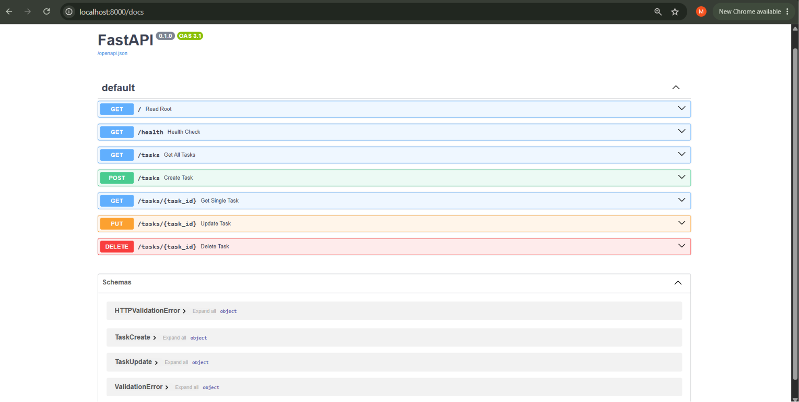

# Task Management CRUD API

A simple and robust To-Do List CRUD API built using Python and FastAPI for the FlyRank Internship Assignment (BE-01).

## 🚀 How to Install & Run

1. Clone the repository:
   git clone https://github.com/madonna-gergis/todo-api.git
   cd todo-api

2. Install dependencies:
   pip install fastapi uvicorn

3. Run the server:
   uvicorn main:app --reload

4. Access the API:
   - API Base URL: http://localhost:8000/
   - Interactive Swagger Documentation: http://localhost:8000/docs

---

## 📌 API Endpoints

* GET / - Root endpoint returning API metadata (Status: 200 OK)
* GET /health - Server health check endpoint (Status: 200 OK)
* GET /tasks - Retrieve all tasks (Status: 200 OK)
* GET /tasks/{id} - Retrieve a single task by ID (Status: 200 OK / 404 Not Found)
* POST /tasks - Create a new task (Status: 201 Created / 400 Bad Request)
* PUT /tasks/{id} - Update task title and/or done status (Status: 200 OK / 400 / 404)
* DELETE /tasks/{id} - Remove a task by ID (Status: 204 No Content / 404 Not Found)

---

## 📸 Swagger UI Screenshot

---

## 💻 Sample Output (curl -i)

curl -i http://localhost:8000/tasks

Response:
HTTP/1.1 200 OK
content-type: application/json

[
  {"id":1,"title":"Buy groceries","done":false},
  {"id":2,"title":"Read a book","done":true},
  {"id":3,"title":"Learn FastAPI","done":false}
]